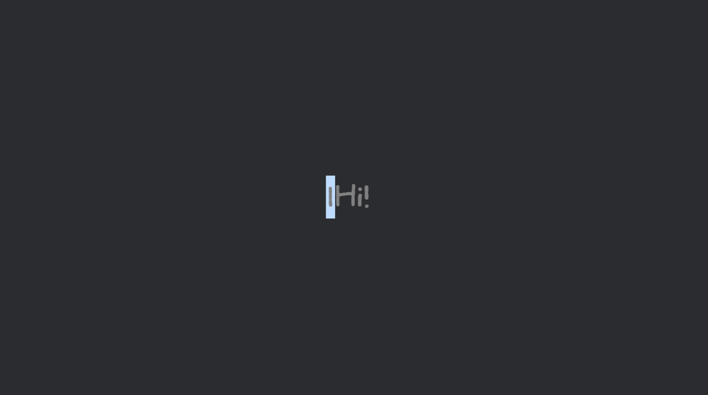

# bevy_bc_ime_text_field

A simple IME-compatible text field plugin for **Bevy** (Windows only).  
Supports both UI and 2D text input, with full Korean/Japanese/Chinese IME support.



## ✨ Features

- IME support (Windows 10 & 11)
- Works with **2D** (`Text2d`) and **UI** (`Text`) text fields
- **Undo / Redo** (`Ctrl+Z` / `Ctrl+Y`)
- Text **selection** (mouse & keyboard)
- **Copy / Paste / Cut** (`Ctrl+C` / `Ctrl+V` / `Ctrl+X`)
- **Select All** (`Ctrl+A`)
- **Password** style masking
- Max length limit
- Events: `TextEdited`, `EnterEvent`

## 📦 Installation
```toml
[dependencies]
bevy_bc_ime_text_field = "0.1"
```

### Version Compatibility

| `bevy` | `bevy_bc_ime_text_field` |
|--------|--------------------------|
| `0.16` | `0.0.1` ~ `0.0.5`        |
| `0.18` | `0.1`                    |

## 🚀 Quick Start
```rust
use bevy::color::palettes::css::PINK;
use bevy::prelude::*;
use bevy_bc_ime_text_field::*;
use bevy_bc_ime_text_field::text_field::*;
use bevy_bc_ime_text_field::text_field_style::*;

fn main() {
    App::new()
        .add_plugins(DefaultPlugins)
        .add_plugins(ImeTextFieldPlugin) // ✅ Required
        .add_systems(Startup, setup)
        .run();
}

fn setup(mut commands: Commands) {
    commands.spawn(Camera2d);

    // 2D text field
    commands.spawn(TextField::new2d(true));

    // UI text field
    commands.spawn(TextField::new(true));

    // With custom style
    commands.spawn((
        TextField::new2d(false),
        TextFieldStyle {
            color: PINK.into(),
            ..Default::default()
        },
    ));

    // Manual setup
    commands.spawn((
        TextField::default(),     // ✅ Required
        TextFieldInfo::default(),
        TextFieldStyle::default(),
        TextFieldInput::default(),
        Text::default(),          // UI mode
        // Text2d::default(),     // 2D mode
        // Sprite::default(),
        // Pickable::default(),
    ));
}
```

## 🔔 Events

Two events are triggered directly on the `TextField` entity:

- `TextEdited` — fires whenever the text changes
- `EnterEvent` — fires when Enter is pressed

## ⌨️ Keyboard Shortcuts

| Shortcut | Action |
|----------|--------|
| `Ctrl+Z` | Undo |
| `Ctrl+Y` / `Ctrl+Shift+Z` | Redo |
| `Ctrl+C` | Copy |
| `Ctrl+V` | Paste |
| `Ctrl+X` | Cut |
| `Ctrl+A` | Select All |
| `Ctrl+Backspace` | Delete word |
| `Shift+Arrow` | Extend selection |

## ⚠️ Notes

- Windows only
- Do **not** add `TextFieldInfo` manually when using `new()` / `new2d()`

## 📄 License

Licensed under either of:

- MIT License ([LICENSE-MIT](LICENSE-MIT))
- Apache License, Version 2.0 ([LICENSE-APACHE](LICENSE-APACHE))

at your option.